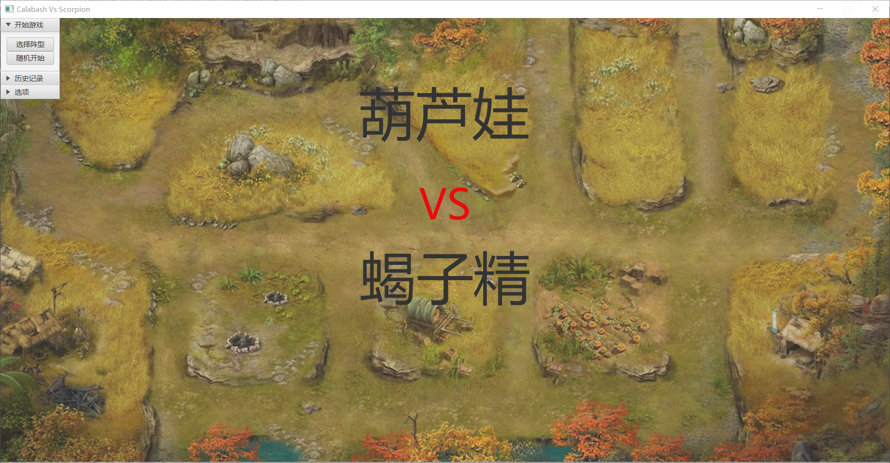
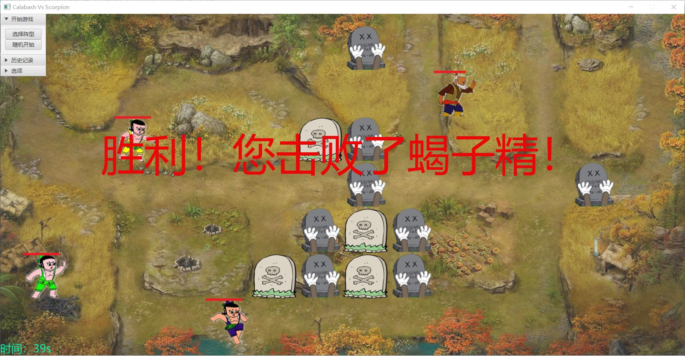
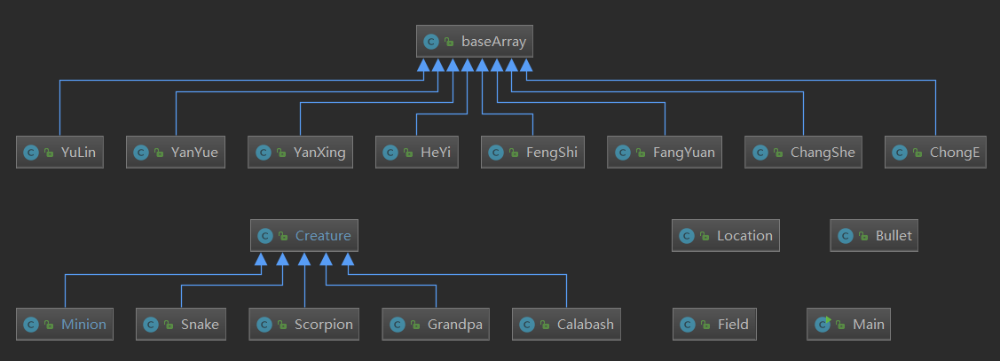

# JAVA大作业——葫芦娃VS蝎子精
## 游戏简介
游戏启动方法：maven clean test package，然后执行java -jar [文件路径]执行jar文件。  
游戏记录存储在src/main/resources/record中，胜负平均有一次记录，可通过“读取文件”进行读取。

### 背景介绍

《葫芦娃VS蝎子精》是基于一部中国原创的优秀动漫《葫芦娃》的世界观制作的。七个葫芦娃和老爷爷，跟蝎子精和蛇精斗智斗勇，并且最终为了保护老爷爷，七个葫芦娃与妖精同归于尽，将其封印。这部动漫确实是包括我在内的很多人的童年回忆。

当然，在我们的这个游戏中，葫芦娃与蝎子精都是平等的，他们都只是一个平凡的Creature（这将在设计过程中提到），所以并没有倾向于哪个阵营，而是让他们公平决斗——**葫芦娃和老爷爷在左边，右边则是凶悍的妖怪阵营**。谁会赢呢？那这一切只能交给系统决定了...

### 规则简介
葫芦娃、老爷爷、蝎子精、蛇精和妖怪小兵在**14x7的战场**上自由移动并且相互为敌，作为正义一方的我们自然是支持葫芦娃的，所以我们可以给七个葫芦娃和老爷爷从**8种不同的阵型中**选择一种排个阵型应对敌方的攻势（或者随机选择一种阵型）。敌人有**蝎子精、蛇精和7个小喽啰**，他们在开始战斗以前也会随机排个阵型。每个角色都有一定的**生命值**，并且**血条**会显示在他们头上。

战斗号角吹响后，所有的角色都开始进行移动。**每个活着的角色在每个活动周期所做的事情如下**：  
1. 如果四周存在敌人，选择一个对它**发起攻击**。这个攻击就是很多回合制游戏中的你打我一下我打你一下，当然是发起者先进行攻击，直到一方死亡为止。死亡的一方会在战场上留下一个一直存在直到游戏结束的**墓碑**，而胜者就可以继续进行第三步。  
2. 如果四周没有敌人，该角色就**随机移动**到上下左右四个格子中的一个。不过在移动之前，需要满足一个条件，即**随机的移动位置必须合法**，不能移动到某个队友所在的格子，当然也不能移出战场。移动完之后进行第三步，言下之意即为**进行战斗之后便不能移动**（让他休息一下嘛）。  
3. 进行战斗或移动之后，这个角色可以**发射一枚子弹**，这颗子弹将横向穿过战场（我方阵营的子弹向右飞，敌方的向左飞），并且会穿过友方角色以及地图上的墓碑，直到击中敌方角色、与敌方子弹相撞抵消，或是飞出地图。被击中的角色将失去与子弹攻击力相当的生命值，也可能触发死亡事件。

*注：在角色阵亡产生墓碑后，该墓碑不影响地形，角色和子弹可以从墓碑格上通过。*

敌人的数量比我方多一个，该怎么赢呢？我们可以靠**属性**取胜——每个角色都有其自己的属性，包括最大生命值、近战攻击力、射击攻击力等，不同种类的角色属性自然不同；同时，每个角色都有回合这一概念，于是为了区分不同角色的功能，引入了**移动和射击的回合间隔**，我们在游戏中可以发现年老体衰的老爷爷每隔好几个回合才移动一次。但喋喋不休的他射击速度却很快。

游戏开始后，每个角色都按照上述规则进行回合制活动，直到一方角色全部死亡，游戏就结束。为了防止游戏过于冗长，在120秒后，游戏也会自动结束。在窗口左下角可以看到当前游戏进行了多久。

***友情提示：初始界面、战斗界面及游戏结束界面均有对应的BGM，请打开音响或者戴上耳机游玩。***

### 操作介绍
可以在左上角下拉框中任选功能，功能包括：  
1. 开始游戏：在这一栏中可以选择以随机阵型开始，或从8种阵营中自选开始游戏；
2. 历史记录：在这一栏中可以选择通过“读取文件”复盘某一次战役，并且在一次战役结束后可以选择“上一场”将该场战役重新回放，或者保存上一次战役；
3. 选项：在这一栏中可以查看“关于”界面，也可以退出程序。

同样可以用下面的快捷键：  
空格键：以随机阵型开始游戏；  
L：读取文件以开始回放；  
X：退出窗口。

## 游戏效果图
开始界面如下，可以在左上角下拉框中选择功能。目前实现的功能有选择阵型开始游戏、以随机阵型开始游戏、载入上一场对战、读取文件中的对战、保存对战。

点击选择阵型会弹出阵型的选择框，在此不作截图说明。点击随机开始或者按下空格键，以随机阵型开始战斗，以下是战斗过程的GIF演示。

经过漫长的战斗葫芦娃们总算打败了蝎子精赢得了战斗，此时战场上尸横遍野，你可以选择重新开始对战或者读取之前的对战，也可以将这次战斗保存到一个TXT文件中。

## 设计过程
在战斗中出现的所有“东西”都有一个类对其进行包装。在本项目中的类图如下图所示：

下面将对这些类及其形成的相应系统进行阐述。

### 角色
在葫芦娃世界中共有5种角色：葫芦娃、老爷爷、蝎子精、蛇精和小喽啰。他们均继承Creature这一基类，并且有许多共性，都能动、能打、能射击、能死...所以令他们都继承自Creature基类，以复用这些方法。这些对象唯一的不同之处在于他们有不同的生命值、近战攻击力、射击攻击力、移动回合间隔、射击回合间隔，以及人物图片和墓碑图片。这些在角色创建时就已经确定好。

### 阵型
在本战斗中一共实现了8种阵型，均继承baseArray这一基类，其中含有用于表示我方或敌方阵型中各个角色位置信息的数组。在初始化战场时需要用到。

### 位置
Location类作为辅助类用来表示角色在地图上的位置。地图共14x7格，每格为100x100像素。Location使用标准坐标，即左上角为(0, 0)，x最大为13而y最大为6。每个角色都拥有一个Location对象用来表示其当前所在的位置，在移动和判断周围敌人时也基于此进行判断。

### 线程系统
线程系统用来进行角色的行动。Creature类含有Runnable接口，通过调用run()方法进行线程的运行。每个角色就是一个线程。在角色run之后，进行一个直到角色死亡或者游戏结束才会停止的循环，每个循环中该角色进行之前所述的攻击/移动、射击两个动作，然后中止一段时间以使得其他线程也进行这一个回合。回合长度就等于线程中止的时长。线程中止的时长必须大于其他所有线程执行角色基本操作的时间之和（这是肯定的），这样也在一定程度下减少了线程之间的干扰。

### 战场
在Javafx中有Controller的概念，Controller作为一个类，可以对UI窗口进行操作，在本项目中将Field类作为Controller对整个战场进行操作。具体UI实现见下面的段落。

Field包含有战场的基本信息，包括14x7的ArrayList用来实时监控战场上的各个角色的情况、初始化战场使用的双方阵型信息、双方角色信息、用于GUI显示的工具以及各种辅助对象等。Field是全局的调度者，在对象进行基本操作后必须通知Field以更新该对象的状态，从而能够使其他对象通过Field得到最近更新的战场情况，同时使Field能够更新战场情况至GUI。

### 多线程
在战场上有共计17个角色，我们不使用一个统一的“司令官”来统率它们的行动，而是让他们各自为政，所以每个角色都对应一个线程。如上文所述线程会执行基本操作，但是这些基本操作可能会对其他线程产生影响，例如攻击可能会使得其他线程死亡，同时进行移动可能会造成冲突等。为此，进行了有关线程安全的代码编辑，利用sleep及调度机制等机制避免了进程间的冲突。

### 墓碑
在角色阵亡后，在战场的ArrayList中即不存在该Creature，它已被踢出战场。所剩下来的是该角色对应阵营的一个墓碑，该墓碑会一直留在地图上，并且可以被其他单位穿过。墓碑在下一场战斗前消失。如果有角色在有墓碑的格子上阵亡，他的墓碑将覆盖原来的墓碑。

### 子弹
Bullet类用来表示角色所发射的子弹，从Creature的射击攻击力中获取该子弹的攻击力。子弹发射之后沿着X轴一直飞行，直到碰到敌方活体或者飞出地图。子弹方向和图片根据阵营决定，并且友方角色和墓碑对其不造成干扰。子弹地图在Field中使用专门的ArrayList维护。

### UI
UI界面用来图像化上述所有的信息。作为Controller的Field类与一个FXML文件绑定，从中读取UI界面的初始控件并对界面进行各种操作。在界面上贴图片使用Canvas画布控件，用内部方法drawImage()实时更新战场信息，即将各个角色、墓碑、子弹的图片画上去。以一定的频率更新画布，达成动画的效果。使用AnimationTimer以达成定时刷新的效果。

### Main
主界面即整个游戏窗口的载体，通过Stage类打开一个窗口，将整个程序显示在窗体里。

### 键盘监控
使用键盘监控以实现快捷键位设置。在Main和Controller中必要处添加键盘监控，在必要的地方覆盖了一些控件的默认按键监控。

### 文件
战斗记录使用txt文件保存，以一定的规则存取战斗中每一帧时战场上的角色、墓碑、子弹等情况。每次战斗结束后都可以选择将本次对战保存至一个文件，同时可以选择一个文件进行读取复现某一次战役。最后，也可以使用”上一场“功能快速复现上一场战役。

## 面向对象设计思想
在本次实验中使用了以下的面向对象射击思想和方法：
1. 面向对象设计原则：在战场上所有的物体，无论是不是生物，无论动或不动，都以一个对象来表示；
2. SRP单一职责原则：除了Field应用了一个Controller类概念以外，其他的类仅提供一类功能，例如表示生物的Creature类及其子类均只会进行生物的基本操作；
3. OCP开闭原则：举Creature为例，其各个继承子类均不能修改它的内部功能，但可以根据类型的不同扩展公共接口；
4. LSP里氏代换原则：举baseArray为例，各个阵型均继承自该抽象类。baseArray和Creature均满足子类能被用在基类出现的地方，并且子类没有比基类更多的限制；
5. 组合模式、默认适配器模式设计：Javafx UI使用组合模式和默认适配器模式设计，通过各种控件的组合建立主窗口并执行各种任务，同时使用默认适配器建立窗口；
6. 观察者模式：Javafx使用观察者模式监控控件，例如按键的点击、键盘事件的监听等；
7. 结构化设计方法和模板方法模式：所有类中的部分-整体关系十分清晰，并且各种算法、方法高度封装，接口调用清晰合理，易于理解，方便外层对象对该对象进行各种复杂操作。

## 总结
在这次Java大作业中，确实花了很多的时间和精力对游戏进行构思、开发、调优等。同时也发现了自己对面向对象程序设计的理解上的不足，这个版本还是有很多不符合面向对象程序设计思想的地方，可以说这是一次很好的学习过程。这次实验也让我理解到，编程水平并不体现在知道多少函数、多少类，而在于自己写的时候能够合理安排软件框架，合理安排各个类以及它们之间的关系。在这方面我做的还不是很好，但自认确实在课程中得到了提高。

最后，感谢两位老师和两位助教这一学期的工作和奉献。